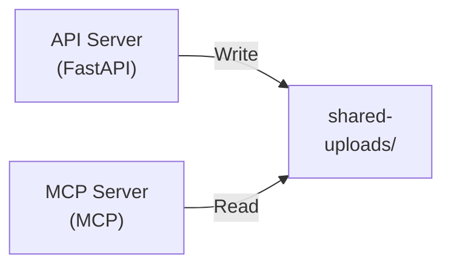

# Ressl Assignment

This repository is my submission to Ressl's assignment.

## Overview

This project consists of two complementary servers that work together to provide file upload, parsing, and search capabilities:

1. **API Server** - A FastAPI-based REST API for uploading and managing files. It automatically parses complex document formats (PDF, DOCX, PPTX, XLSX, etc.) into Markdown using the `markitdown` library.

2. **MCP Server** - A Model Context Protocol (MCP) server for searching through uploaded files. It can search for keywords or regex patterns across files.

Both servers share a common `shared-uploads/` directory where files are stored.

## Architecture



### How It Works

1. **API Server** handles file uploads:
   - Accepts files via REST API endpoints
   - Automatically parses Office documents (PDF, DOCX, PPTX, XLSX, etc.) into Markdown format
   - Stores both original and parsed files in the `shared-uploads/` directory
   - Provides endpoints to list and manage uploaded files

2. **MCP Server** provides search capabilities:
   - Searches for keywords or regex patterns across uploaded files
   - Automatically resolves parsed `.markdown` files when searching Office documents
   - Can search in specific files or across all files
   - Returns matches with line numbers and content

## Quick Start

### API Server
See [api-server/README.md](api-server/README.md) for detailed setup and running instructions.

### MCP Server
See [mcp-server/README.md](mcp-server/README.md) for detailed setup and running instructions.

## Project Structure

```
.
├── api-server/         # FastAPI REST API server
│   ├── main.py         # API endpoints and file handling
│   ├── schema.py       # Pydantic models
│   └── README.md       # Detailed API Server documentation
├── mcp-server/         # MCP protocol server
│   ├── main.py         # MCP tools and search logic
│   ├── schema.py       # Pydantic models
│   └── README.md       # Detailed MCP Server documentation
└── shared-uploads/     # Shared directory for uploaded files
```
